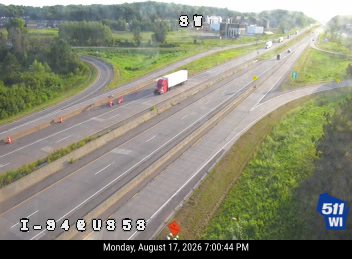

# Wisconsin 511 API PHP Library

An unofficial library for the Wisconsin 511 API.


## Requirements

* PHP 8.1 or above
* [Composer](https://getcomposer.org)
* A [Wisconsin 511 API key](https://511wi.gov/developers/doc)

## Quick set up

`git clone git@github.com:ruscoe/wi511-php.git`

`cd wi511-php`

`composer install`

## Usage examples

The following examples assume you store your API key in an environment variable.
To do this on a Linux or MacOS system, run:

`export WI511_API_KEY=d605...`

Be sure to substitute your own API key after `WI511_API_KEY=`.

### Cameras

```php
<?php

require __DIR__ . '/vendor/autoload.php';

$api_key = getenv('WI511_API_KEY');

$api = new WI511\WICameras($api_key);

$response = $api->saveCameraImage(468, 'camera.png');
```

The response:



```php
<?php

require __DIR__ . '/vendor/autoload.php';

$api_key = getenv('WI511_API_KEY');

$api = new WI511\WICameras($api_key);

$response = $api->getCameras();

var_dump($response);
```

The response:

```
array(489) {
  [0]=>
  object(stdClass)#35 (12) {
    ["Id"]=>
    int(1)
    ["Source"]=>
    string(4) "ATMS"
    ["SourceId"]=>
    string(1) "1"
    ["Roadway"]=>
    string(10) "I-39/US 51"
    ["Direction"]=>
    string(7) "Unknown"
    ["Latitude"]=>
    float(44.454149)
    ["Longitude"]=>
    float(-89.518702)
    ["Location"]=>
    string(22) "I-39/US 51 at County B"
    ["SortOrder"]=>
    int(0)
    ["Views"]=>
    array(1) {
      [0]=>
      object(stdClass)#33 (5) {
        ["Id"]=>
        int(937)
        ["Url"]=>
        string(30) "https://511wi.gov/map/Cctv/937"
        ["Status"]=>
        string(7) "Enabled"
        ["Description"]=>
        string(0) ""
        ["VideoUrl"]=>
        string(59) "https://cctv1.dot.wi.gov/rtplive/CCTV-49-0011/playlist.m3u8"
      }
    }
    ["Region"]=>
    string(20) "North Central Region"
    ["County"]=>
    string(7) "Portage"
  }
}
```

### Message Signs

```php
<?php

require __DIR__ . '/vendor/autoload.php';

$api_key = getenv('WI511_API_KEY');

$api = new WI511\WIMessageSigns($api_key);

$response = $api->getMessageSigns();

var_dump($response);
```

The response:

```
array(170) {
  [0]=>
  object(stdClass)#35 (9) {
    ["Id"]=>
    string(11) "ATMS_DMS--1"
    ["Name"]=>
    string(27) "I-41/894 NB @ Cleveland Ave"
    ["Roadway"]=>
    string(8) "I-41/894"
    ["DirectionOfTravel"]=>
    string(10) "Northbound"
    ["Messages"]=>
    array(1) {
      [0]=>
      string(49) "BARKER RD	11 MIN
CAPITOL DR	8 MIN
DOWNTOWN	16 MIN"
    }
    ["Latitude"]=>
    float(42.99461)
    ["Longitude"]=>
    float(-88.03796)
    ["LastUpdated"]=>
    int(1787006108)
    ["County"]=>
    string(9) "Milwaukee"
  }
}
```

### Truck Parking

```php
<?php

require __DIR__ . '/vendor/autoload.php';

$api_key = getenv('WI511_API_KEY');

$api = new WI511\WITruckParking($api_key);

$response = $api->getTruckParking();

var_dump($response);
```

The response:

```
array(15) {
  [0]=>
  object(stdClass)#35 (10) {
    ["Id"]=>
    int(1)
    ["FacilityName"]=>
    string(42) "Portage Rest Area #11, Columbia County, WI"
    ["Roadway"]=>
    string(19) "I-39/90/94 EB exit "
    ["TotalParkingSpaces"]=>
    string(2) "68"
    ["AvailableParkingSpaces"]=>
    string(2) "47"
    ["Trend"]=>
    string(7) "FILLING"
    ["Open"]=>
    string(3) "Yes"
    ["Latitude"]=>
    float(43.428772)
    ["Longitude"]=>
    float(-89.483492)
    ["Amenities"]=>
    array(13) {
      [0]=>
      string(27) "Men's and women's restrooms"
      [1]=>
      string(24) "Family/assisted restroom"
      [2]=>
      string(22) "Handicapped accessible"
      [3]=>
      string(30) "Seasonal prairie walking paths"
      [4]=>
      string(20) "Children's play area"
      [5]=>
      string(14) "Drinking water"
      [6]=>
      string(16) "Vending machines"
      [7]=>
      string(26) "Travel/weather information"
      [8]=>
      string(19) "Telephones plus TTY"
      [9]=>
      string(22) "Picnic area and tables"
      [10]=>
      string(17) "Pet exercise area"
      [11]=>
      string(15) "Recycling areas"
      [12]=>
      string(26) "Diaper changing facilities"
    }
  }
}
```

## Winter Road Conditions

```php
<?php

require __DIR__ . '/vendor/autoload.php';

$api_key = getenv('WI511_API_KEY');

$api = new WI511\WIWinterRoads($api_key);

$response = $api->getWinterRoads();

var_dump($response);
```

The response:

```
array(1175) {
  [0]=>
  object(stdClass)#35 (8) {
    ["Id"]=>
    int(2706)
    ["LocationDescription"]=>
    string(42) "STH 83, Illinois St. line to E jct. STH 50"
    ["Overall Condition"]=>
    string(6) "Normal"
    ["AreaName"]=>
    string(7) "Kenosha"
    ["RoadwayName"]=>
    string(5) "WI-83"
    ["EncodedPolyline"]=>
    string(218) "cbybG~fyxO?a@|@_@^OJErAg@TIbBm@dBu@bBs@PG`Bi@b@O@?z@WZKvAa@lA]~Ac@NE|K}CjKiDpKaDtGkBr@QlBk@lBi@nA]lPcF|ZgJnx@}UvJwCpUiHfBi@rAa@tA[rASpS_CTAfRwB|OgBvR{BvPyBnC[jRyBbGs@dSeChU_C`CYbCU`CWbCYfCY~BUb@G~AUp@IjCYzBWd@E`BMx@@H?"
    ["LastUpdated"]=>
    int(1787006123)
    ["RoadSurface"]=>
    string(3) "Dry"
  }
}
```

### Traffic Events

```php
<?php

require __DIR__ . '/vendor/autoload.php';

$api_key = getenv('WI511_API_KEY');

$api = new WI511\WIEvents($api_key);

$response = $api->getEvents();

var_dump($response);
```

The response:

```
array(1621) {
  [0]=>
  object(stdClass)#35 (27) {
    ["ID"]=>
    int(566011)
    ["SourceId"]=>
    string(15) "WisLCS-268178-1"
    ["Organization"]=>
    string(4) "WZDx"
    ["RoadwayName"]=>
    string(4) "I-94"
    ["DirectionOfTravel"]=>
    string(1) "W"
    ["Description"]=>
    string(125) "Roadwork - Mainline Right Lane Closed on I-94 WB from WIS 175 NB-STADIUM INTCHG (BRIDGE CROSSING) to BRIDGE (BRIDGE CROSSING)"
    ["Reported"]=>
    int(1762943400)
    ["LastUpdated"]=>
    int(1772744304)
    ["StartDate"]=>
    int(1762943400)
    ["PlannedEndDate"]=>
    int(1826344799)
    ["LanesAffected"]=>
    string(23) "2 lane(s) of 5 blocked."
    ["Latitude"]=>
    float(43.0337705435589)
    ["Longitude"]=>
    float(-87.969008234053)
    ["LatitudeSecondary"]=>
    float(43.0337146647057)
    ["LongitudeSecondary"]=>
    float(-87.9694979127897)
    ["EventType"]=>
    string(8) "roadwork"
    ["EventSubType"]=>
    string(8) "roadwork"
    ["IsFullClosure"]=>
    bool(false)
    ["Severity"]=>
    string(7) "Unknown"
    ["Comment"]=>
    string(0) ""
    ["EncodedPolyline"]=>
    string(100) "a`teGhm|wOJ`BBnAFzCHhBZvAhB~FfAxEvCnLBd@pBzLdBhLBPV|AR~A@jTHbAIdG?^?fDCpFB|@A`DEbRb@dUJ`DTnFDjALnB@H"
    ["Restrictions"]=>
    object(stdClass)#33 (4) {
      ["Width"]=>
      float(23)
      ["Height"]=>
      NULL
      ["Weight"]=>
      NULL
      ["Speed"]=>
      NULL
    }
    ["DetourPolyline"]=>
    NULL
    ["DetourInstructions"]=>
    NULL
    ["Recurrence"]=>
    string(0) ""
    ["RecurrenceSchedules"]=>
    string(0) ""
    ["County"]=>
    string(9) "Milwaukee"
  }
}
```

## Alerts

```php
<?php

require __DIR__ . '/vendor/autoload.php';

$api_key = getenv('WI511_API_KEY');

$api = new WI511\WIAlerts($api_key);

$response = $api->getAlerts();

var_dump($response);
```

## Travel Times

```php
<?php

require __DIR__ . '/vendor/autoload.php';

$api_key = getenv('WI511_API_KEY');

$api = new WI511\WITravelTimes($api_key);

$response = $api->getTravelTimes();

var_dump($response);
```

The response:

```
array(402) {
  [0]=>
  object(stdClass)#35 (13) {
    ["Id"]=>
    string(4) "3736"
    ["RoadwayName"]=>
    string(8) "I-39/90 "
    ["Description"]=>
    string(40) "I-39/90 NB Illinois State Line to WIS 26"
    ["Distance"]=>
    string(2) "16"
    ["NormalTime"]=>
    string(2) "14"
    ["CurrentTime"]=>
    string(2) "14"
    ["Delay"]=>
    string(1) "0"
    ["Region"]=>
    string(4) "Rock"
    ["StartLatitude"]=>
    string(9) "42.495529"
    ["StartLongitude"]=>
    string(10) "-88.992922"
    ["EndLatitude"]=>
    string(8) "42.72507"
    ["EndLongitude"]=>
    string(10) "-88.991537"
    ["Waypoints"]=>
    array(4) {
      [0]=>
      object(stdClass)#33 (4) {
        ["RoadwayName"]=>
        string(13) "I-39/90 North"
        ["Direction"]=>
        string(1) "N"
        ["Latitude"]=>
        float(42.495529)
        ["Longitude"]=>
        float(-88.992922)
      }
      [1]=>
      object(stdClass)#19 (4) {
        ["RoadwayName"]=>
        string(13) "I-39/90 North"
        ["Direction"]=>
        string(1) "N"
        ["Latitude"]=>
        float(42.49552943)
        ["Longitude"]=>
        float(-88.99292174)
      }
      [2]=>
      object(stdClass)#28 (4) {
        ["RoadwayName"]=>
        string(13) "I-39/90 North"
        ["Direction"]=>
        string(1) "N"
        ["Latitude"]=>
        float(42.72506967)
        ["Longitude"]=>
        float(-88.99153741)
      }
      [3]=>
      object(stdClass)#21 (4) {
        ["RoadwayName"]=>
        string(13) "I-39/90 North"
        ["Direction"]=>
        string(1) "N"
        ["Latitude"]=>
        float(42.72507)
        ["Longitude"]=>
        float(-88.991537)
      }
    }
  }
}
```
